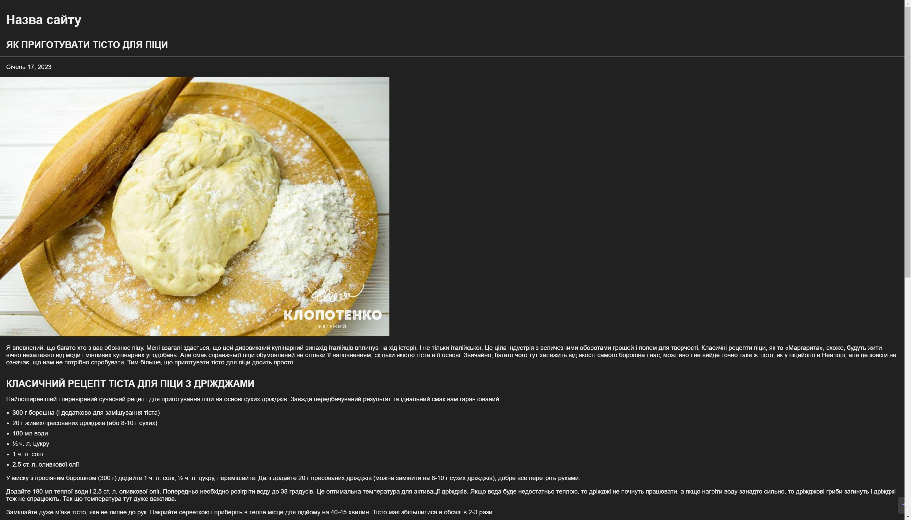

# Freshcode Course

This repository contains all (or almost all) of the materials that were given to us on a free FrontEnd course by Freshcode. It includes lots of different projects as well as notes for the first couple of days when I was not tired of writing them

## Table of Contents

- [Freshcode Course](#freshcode-course)
  - [Table of Contents](#table-of-contents)
  - [Introduction](#introduction)
  - [Motivation](#motivation)
  - [Technologies Used](#technologies-used)
  - [Screenshots](#screenshots)
  - [Contributing](#contributing)
  - [Credits](#credits)
  - [License](#license)

## Introduction

Like I said above, this is a repository where all of my porjects, related to that course, went. We were doing lots of stuff, looking at a bunch of different technologies in both HTML and CSS. It didn't include JavaScript unfortunately, but that makes senes as it was very beginner friendly. Some of the projects we did was a pizza recipe, a final project with Ukrainian victory festival and some other side stuff.

## Motivation

Just a bit more of a background on the project before we move on. Let's talk about my motivation for this course. I am a first year computer science student, as for 2023, I almost finished my second term and the problem with it is that I don't find anything in there particularly interesting, to be brutally honest. I always dreamt to become a front end web developer for some reason, right from the 10th grade in school, and here I am, on the beginning of this journey. I used to do some frontend stuff the summer before my university admission, but I deleted it all and started from a blank slate. So this course is one step towards by goal and my dream. Wish me luck, I hope I'll succeed.

## Technologies Used

- HTML
- CSS
- Git
- VSCode

## Screenshots

## Contributing

Contributions are welcome! If you have a suggestion or improvement, feel free to submit a pull request.

## Credits

Gotta give a massive thanks to the whole Freshcode team and especially our mentor - Alisa from the training center for this wonderful opportunity and for making this nice course free for everyone!

## License

This repository is licensed under the MIT License. See the [LICENSE](LICENSE) file for more information.
